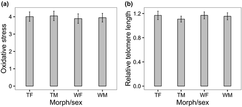

#Data Replication Assignment: Developmental stress and telomere dynamics in a genetically polymorphic species

###Introduction

In this article by Grunst, AS, Grunst, ML, Gonser, RA and Tuttle, EM (2019), they studied different factors that produce different patterns of senescence (the decline in physical and reproductive performance with age) in the dimorphic white-throated sparrow (Zonotrichia albicollis), that displays a genetically determined polymorphism in both sexes (tan or white). Apart from the different genetics, the white-throated sparrow morphs also exhibit different behaviours. 
They studied individual-level factors derived from developmental stress, focusing in telomere lenght and oxidative stress. They look at these variables are affected by growth rate, size rank, etc. taking into account the different morph-sex classes and individual identity. The objective of this was trying to see if morph–sex differences in OS or telomere length occur in the nestlings and if they can explain the different patterns of senescence during adulthood. Previous studies have mixed results about the relationship of telomere lenght and oxidative stress. The study was done in nestlings.


Telomere length was determined using a relative real-time qPCR assay, which measures telomere length relative to a single copy reference gene. They used glyceraldehyde-3-phosphate dehydrogenase (GAPDH) as our reference gene.

They measured total antioxidant capacity (TAC) in the plasma using the OXY-adsorbent kit, and reactive oxygen metabolites (ROMs) in the plasma using Diacron International’s d-ROMs kit. Oxidative stress was calculated as: mM ROMs/mM HOCl neutralized (TAC) × 1,000.


Growth rates were calculated using the slope of a linear regression of mass versus nestling age. 
Nestling size rank was determined by ordering nestlings within broods from largest to smallest. The largest nestling received a rank of 1 and the smallest a rank equal to the brood size.


###Statistical analysis

In order to do this study, they performed analysis by linear mixed effect models (LMM) to analyse differences in OS and RTL according to different factors, with nest, father and mother identity as random effects. As fixed effects, they entered nestling morph–sex, the morph composition of the parental pair, brood size, clutch initiation date, time of blood sampling (excluded in the telomere model), year, growth rate, size rank and age. OS level was additionally included as a fixed effect in the model predicting RTL.


###Loading necessary packages

```{r}

library(lme4)
library(curl)
library(sciplot)
library(ggplot2)
library(gridExtra)
## In the paper they state that they have used the package lme4 for this analysis.

```


###Loading the data

Now we are going to load and take a look at our data

```{r}

f <- curl("https://raw.githubusercontent.com/dalarre/replication_dalarre/main/telomere_data_1_pruebas.csv")
d <- read.csv(f, header = TRUE, sep = ";", stringsAsFactors = FALSE)
head(d)
names(d)


```


```{r}
summary(d) 

```
Here we can see a summary of our data. Notice how there are two replicates of each individual. 
We are going to focus in the OS variable, which already has the results of oxidative stress after calculating it with the formula described before. We are also going to use the RTL.average variable, which refers to the relative telomere lenght averaged from the two measures of the same individual. MorphWT and SexMF define the morph-sex of the individuals and are also essential variables for this study. Notice that they are defined as characters. They are combined in the variable type

Now we are going to calculate the mean and standard error of OS to see if it is the same as they say in the article:

```{r}
os <- na.omit(d$OS) ## omit the NAs
mean(os)
se(os)
length(os)
```
The mean and SE are similar but a bit different of what the article states (3.91 ± 0.13). The difference is probably due to a difference in the number of samples. In the article they say that N = 244, but in the data posted in dryad used here, N = 210.

Now we are going to do the same with the average relative telomere length:

```{r}

telomere <- na.omit(d$RTL.average) ## omit the NAs
mean(telomere)
se(telomere)
length(telomere)
```
The results are again slightly different because of the dataset differences. They results are 1.137 ± 0.028 with a sample size of 218.


###Replicating Figure 3:

The figure are two barplots and their height is the mean of oxidative stress or relative telomere length of each type of morph-sex. The first problem is how to divide the dataset into the different morph-sex types. I found you can do this with the split function:

```{r}
morphsex <- na.omit(d$Type) ## Need to omit the NAs to avoid errors
groups <- split(d, f = factor(morphsex)) ## This divides the dataset d into groups defined by the different categories in the type variable.

```

```{r}
TF_OSmean <- mean(na.omit(groups$TF$OS))
TF_OSse <- se(na.omit(groups$TF$OS))

TM_OSmean <- mean(na.omit(groups$TM$OS))
TM_OSse <- se(na.omit(groups$TM$OS))

WF_OSmean <- mean(na.omit(groups$WF$OS))
WF_OSse <- se(na.omit(groups$WF$OS))

WM_OSmean <- mean(na.omit(groups$WM$OS))
WM_OSse <- se(na.omit(groups$WM$OS))

morphsex_OSmeans <- c(TF_OSmean,TM_OSmean,WF_OSmean,WM_OSmean)
morphsex_OSse <- c(TF_OSse,TM_OSse,WF_OSse,WM_OSse)


TF_RTLmean <- mean(na.omit(groups$TF$RTL.average))
TF_RTLse <- se(na.omit(groups$TF$RTL.average))

TM_RTLmean <- mean(na.omit(groups$TM$RTL.average))
TM_RTLse <- se(na.omit(groups$TM$RTL.average))

WF_RTLmean <- mean(na.omit(groups$WF$RTL.average))
WF_RTLse <- se(na.omit(groups$WF$RTL.average))

WM_RTLmean <- mean(na.omit(groups$WM$RTL.average))
WM_RTLse <- se(na.omit(groups$WM$RTL.average))

morphsex_RTLmeans <- c(TF_RTLmean,TM_RTLmean,WF_RTLmean,WM_RTLmean)
morphsex_RTLse <- c(TF_RTLse,TM_RTLse,WF_RTLse,WM_RTLse)


df <- data.frame(type = c("TF", "TM", "WF", "WM"), OSmean = morphsex_OSmeans, OSse = morphsex_OSse, RTLmean = morphsex_RTLmeans, RTLse = morphsex_RTLse)

## Now I calculate the means and standard errors of the different morph-sex types for the variables we are going to represent in the barplot and create a dataframe to manipulate them easily.

```
Now that we have the data, lets do the graphs. For that, I use ggplot2 and the gridExtra to put the 2 ggplots together as in the original figure.

```{r}
p <- ggplot(data = df, aes(x=type, y=OSmean)) + geom_bar(stat="identity", width = 0.3) + geom_errorbar(aes(x=type, ymin = morphsex_OSmeans-morphsex_OSse, ymax = morphsex_OSmeans+morphsex_OSse), width = 0.05 ) + xlab("Morph/sex") + ylab("Oxidative stress") + annotate("text", x = 0.65, y = 4.25, label = "(a)", size = 6) + theme_bw()
p

## The heights are the means and the error bars are the standard errors as it is described in the figure

q <- ggplot(data = df, aes(x=type, y=RTLmean)) + geom_bar(stat="identity", width = 0.3) + geom_errorbar(aes(x=type, ymin = morphsex_RTLmeans-morphsex_RTLse, ymax = morphsex_RTLmeans+morphsex_RTLse), width = 0.05 ) + xlab("Morph/sex") + ylab("Relative telomere length") + annotate("text", x = 0.65, y = 1.3, label = "(b)", size = 6) + ylim(0, 1.3) + theme_bw()


grid.arrange(p, q, nrow = 1)

```
Let's compare it now with the original figure:

</br>




###Replicating table 2

```{r}

growthrate <- d$Growth.rate..g/d$Growth.rate.mm


```

```{r}

barplot(height = morphsex_means)

lmer(data = d, d$OS ~ d$RTL.average + d$Type + d$PairType + d$BroodSize + d$Year + d$NestlingAge + d$Size.Rank + growthrate + (1|d$FatherBand) + (1|d$MotherBand))

```


